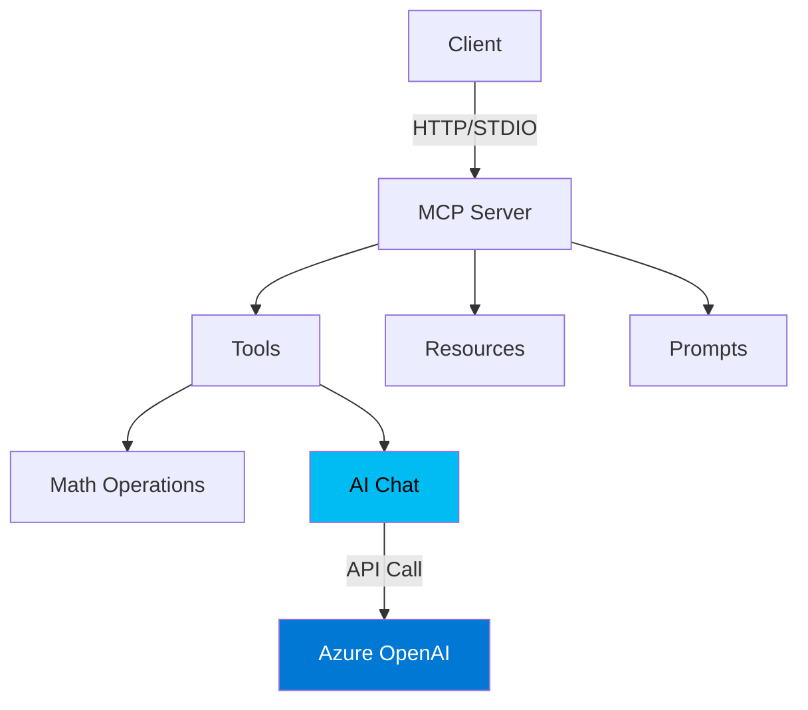

# MCP Server Java

Model Context Protocol (MCP) server in Java with Azure OpenAI integration.

## Architecture



## Features

**Tools**: `add`, `multiply`, `get_current_time`, `greet`, `ai_chat`  
**Resources**: `server-info`, `documentation`  
**Prompts**: `math_helper`, `current_time`

## Prerequisites

- Java 17+
- Maven 3.6+
- Azure OpenAI account (for ai_chat tool)

## Quick Start

### 1. Build

```bash
mvn clean package
```

### 2. Configure Azure OpenAI

**PowerShell:**
```powershell
$env:AZURE_OPENAI_API_KEY="your-api-key-here"
$env:AZURE_OPENAI_ENDPOINT="https://your-resource.cognitiveservices.azure.com"
$env:AZURE_OPENAI_DEPLOYMENT="o4-mini"
$env:AZURE_OPENAI_API_VERSION="2024-12-01-preview"
```

**Bash:**
```bash
export AZURE_OPENAI_API_KEY="your-api-key"
export AZURE_OPENAI_ENDPOINT="https://your-resource.cognitiveservices.azure.com"
export AZURE_OPENAI_DEPLOYMENT="o4-mini"
export AZURE_OPENAI_API_VERSION="2024-12-01-preview"
```

> **⚠️ Important**: The `o4-mini` model requires `max_completion_tokens` (not `max_tokens`) and only supports `temperature=1.0`.

### 3. Run Server & Client

You'll need **two separate terminals**:

**Terminal 1 - Server:**
```bash
java -jar target/mcp-server-java-1.0.0.jar --http
```
Keep this running. Server starts on `http://localhost:8080`

**Terminal 2 - Client (Testing):**

Use this terminal to test all tools with curl commands below.

### 4. Test Tools

```bash
# List tools
curl http://localhost:8080/tools

# Math operations
curl -X POST http://localhost:8080/tools/add -H "Content-Type: application/json" -d '{"a":"7","b":"51"}'
curl -X POST http://localhost:8080/tools/multiply -H "Content-Type: application/json" -d '{"x":"7","y":"70"}'

# AI chat
curl -X POST http://localhost:8080/tools/ai_chat -H "Content-Type: application/json" -d '{"prompt":"What is MCP?"}'

# Other tools
curl http://localhost:8080/tools/time
curl -X POST http://localhost:8080/tools/greet -H "Content-Type: application/json" -d '{"name":"Steve"}'
```

## Integration

### MCP Inspector

The MCP Inspector provides a web-based UI to test your MCP server interactively.

**Prerequisites:**
- Azure OpenAI environment variables must be set (see step 2 above)
- Server must be rebuilt: `mvn clean package -DskipTests`

**Step-by-Step Instructions:**

**Terminal 1** - Stop if anything is running (Ctrl+C)

**Terminal 2** - Run these commands:

```powershell
# 1. Set environment variables (required for ai_chat tool)
$env:AZURE_OPENAI_API_KEY="your-api-key-here"
$env:AZURE_OPENAI_ENDPOINT="https://your-resource.cognitiveservices.azure.com"
$env:AZURE_OPENAI_DEPLOYMENT="o4-mini"
$env:AZURE_OPENAI_API_VERSION="2024-12-01-preview"

# 2. Start the Inspector (it will launch the server automatically)
npx @modelcontextprotocol/inspector java -jar target/mcp-server-java-1.0.0.jar
```

**In the Browser:**

1. The Inspector will open automatically
2. Verify **Transport Type** is set to **"STDIO"**
3. Verify **Arguments** shows `-jar target/mcp-server-java-1.0.0.jar`
4. Click **"Connect"**

**Testing Tools:**

1. Click the **"Tools"** tab at the top of the Inspector
2. Click **"List Tools"** to see all 5 available tools
3. Select a tool from the list to test it

**Test each tool:**

- **add** - Click on "add" in the list
  - Input: `{"a": 5, "b": 3}`
  - Expected result: `The result is: 8`
  
- **multiply** - Click on "multiply" in the list  
  - Input: `{"x": 7, "y": 6}`
  - Expected result: `The result is: 42`
  
- **get_current_time** - Click on "get_current_time"
  - No parameters needed (leave empty or use `{}`)
  - Expected result: Current timestamp
  
- **greet** - Click on "greet"
  - Input: `{"name": "Steve"}`
  - Expected result: `Hello Steve welcome to the Java MCP Server!`
  
- **ai_chat** - Click on "ai_chat"
  - Input: `{"prompt": "Say hello in 3 words"}`
  - **Leave max_tokens empty** (uses default 500)
  - Expected result: AI-generated greeting (e.g., "Hello my friend")
  - ⏱️ Takes 5-10 seconds (Azure OpenAI processing time)

> ⚠️ **Important for ai_chat**: The o4-mini model uses **200-400 reasoning tokens internally** before generating output. The default max_tokens=500 ensures enough tokens for both reasoning (internal thinking) and actual output. For complex prompts, use 700-1000 tokens.

### VS Code Integration

Add this MCP server to your VS Code project to use it with GitHub Copilot Chat.

**Step-by-Step Instructions:**

1. **Build the server** (if not already done)
   ```bash
   mvn clean package -DskipTests
   ```

2. **Create the `.vscode` folder** (if it doesn't exist)
   - In your project root, create folder named `.vscode`

3. **Create the `mcp.json` file**
   - Copy `.vscode/mcp.json.template` to `.vscode/mcp.json`
   - Or create `.vscode/mcp.json` manually

4. **Add the server configuration**
   
   Edit `mcp.json` with your settings:

   ```json
   {
     "mcpServers": {
       "mcp-server-java": {
         "command": "java",
         "args": [
           "-jar",
           "C:\\Temp\\GIT\\MCP_SERVER_JAVA\\target\\mcp-server-java-1.0.0.jar"
         ],
         "env": {
           "AZURE_OPENAI_API_KEY": "your-api-key-here",
           "AZURE_OPENAI_ENDPOINT": "https://your-resource.cognitiveservices.azure.com",
           "AZURE_OPENAI_DEPLOYMENT": "o4-mini",
           "AZURE_OPENAI_API_VERSION": "2024-12-01-preview"
         }
       }
     }
   }
   ```

   > 💡 **Important:** 
   > - Update the `args` path to match your project location
   > - Use double backslashes (`\\`) on Windows or forward slashes (`/`) for paths
   > - Replace Azure credentials with your actual values

5. **Reload VS Code**
   - Press `Ctrl+Shift+P` (Windows) or `Cmd+Shift+P` (Mac)
   - Type: `Developer: Reload Window`
   - This activates the MCP server

**Verify It's Working:**

1. Open GitHub Copilot Chat in VS Code
2. Click the **attachments icon (📎)** in the chat input
3. You should see your MCP tools listed:
   - `add` - Add two numbers
   - `multiply` - Multiply two numbers
   - `get_current_time` - Get current time
   - `greet` - Greet by name
   - `ai_chat` - Chat with Azure OpenAI

**Example Prompts to Test:**

Try these prompts in GitHub Copilot Chat:

**Math Operations:**
```
Add 42 and 58
```
```
What is 15 multiplied by 8?
```
```
Calculate 100 + 250, then multiply the result by 3
```

**Time and Greetings:**
```
What time is it?
```
```
Greet me with the name Alex
```

**AI Chat Tool:**
```
Use the AI chat tool to write a haiku about programming
```
```
Ask the AI: What are the main benefits of using MCP servers?
```
```
Using ai_chat, explain the Model Context Protocol in one sentence
```

**Resources:**
```
Show me the server information
```
```
Get the MCP documentation resource
```

**Combined Operations:**
```
Get the current time and greet me with the name Sarah
```

> 💡 **Tip:** You don't need to explicitly mention tool names - just ask naturally and Copilot will figure out which tools to use!

**Troubleshooting:**

- **Server not found:** Check that the JAR path in `mcp.json` matches your actual file location
- **Server fails to start:** Run `java -jar target/mcp-server-java-1.0.0.jar` in terminal to see error messages
- **Environment variables not set:** Verify the `env` section in `mcp.json` has the correct Azure credentials
- **Tools not appearing:** Reload VS Code window (`Ctrl+Shift+P` → `Developer: Reload Window`)
- **Check server logs:** Look at VS Code's Output panel → Select "MCP" from dropdown to see server logs

## Development

### Project Structure

```
src/main/java/com/example/mcp/
├── Main.java              # Entry point
├── HttpJsonServer.java    # HTTP API
├── AzureAIClient.java     # Azure OpenAI client
├── ToolsProvider.java     # Tool implementations
├── ResourcesProvider.java # Resource implementations
└── PromptsProvider.java   # Prompt implementations
```

### Adding Tools

Edit `ToolsProvider.java`:

```java
// Register tool
Tool myTool = new Tool();
myTool.setName("my_tool");
myTool.setDescription("What it does");
tools.add(myTool);

// Handle tool call
case "my_tool":
    return new TextContent("Result");
```

## Troubleshooting

**Server exits immediately**: Use `Start-Process powershell -ArgumentList "-NoExit", "-Command", "java -jar target/mcp-server-java-1.0.0.jar --http"` to run in separate window.

**Azure API errors**: Check API version (2024-12-01-preview required) and model constraints (o4-mini needs `max_completion_tokens`, `temperature=1.0`).

## Testing with MCP Inspector

```bash
npx @modelcontextprotocol/inspector java -jar target/mcp-server-java-1.0.0.jar
```

## Resources

- [MCP Documentation](https://modelcontextprotocol.io)
- [MCP Java SDK](https://github.com/modelcontextprotocol/java-sdk)
- [MCP Specification](https://spec.modelcontextprotocol.io)

## License

MIT
