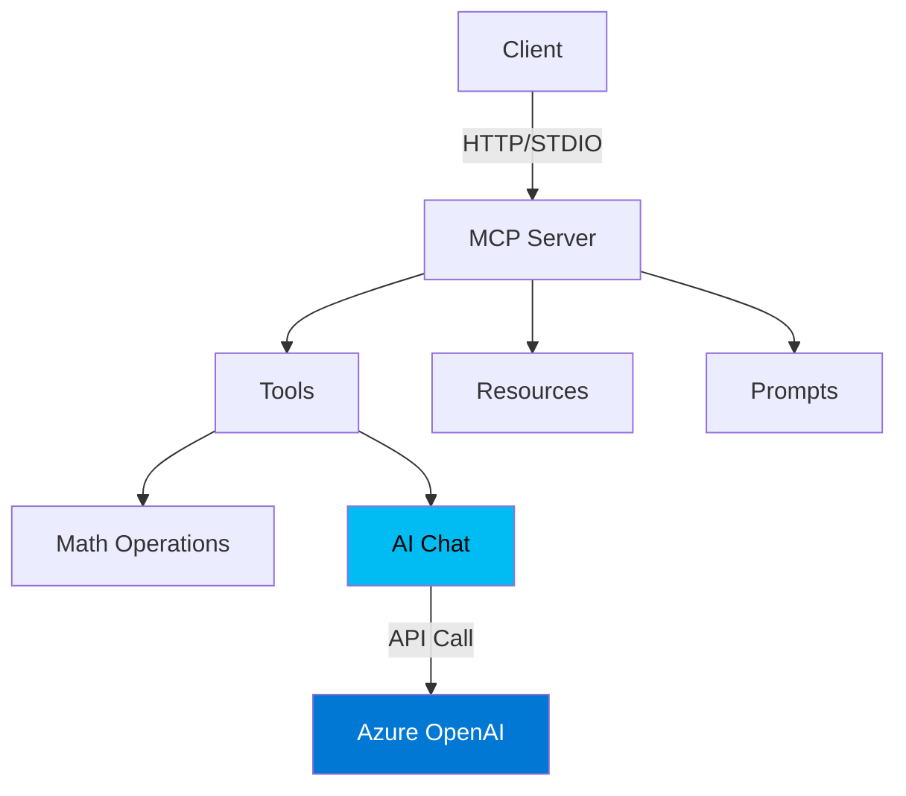

# MCP Server Java

Model Context Protocol (MCP) server in Java with Azure OpenAI integration.

## Architecture



## Features

**Tools**: `add`, `multiply`, `get_current_time`, `greet`, `ai_chat`  
**Resources**: `server-info`, `documentation`  
**Prompts**: `math_helper`, `current_time`

## Prerequisites

- Java 17+
- Maven 3.6+
- Azure OpenAI account (for ai_chat tool)

## Quick Start

### 1. Build

```bash
mvn clean package
```

### 2. Configure Azure OpenAI

**PowerShell:**
```powershell
$env:AZURE_OPENAI_API_KEY="your-api-key"
$env:AZURE_OPENAI_ENDPOINT="https://your-resource.cognitiveservices.azure.com"
$env:AZURE_OPENAI_DEPLOYMENT="o4-mini"
$env:AZURE_OPENAI_API_VERSION="2024-12-01-preview"
```

**Bash:**
```bash
export AZURE_OPENAI_API_KEY="your-api-key"
export AZURE_OPENAI_ENDPOINT="https://your-resource.cognitiveservices.azure.com"
export AZURE_OPENAI_DEPLOYMENT="o4-mini"
export AZURE_OPENAI_API_VERSION="2024-12-01-preview"
```

> **⚠️ Important**: The `o4-mini` model requires `max_completion_tokens` (not `max_tokens`) and only supports `temperature=1.0`.

### 3. Run Server & Client

You'll need **two separate terminals**:

**Terminal 1 - Server:**
```bash
java -jar target/mcp-server-java-1.0.0.jar --http
```
Keep this running. Server starts on `http://localhost:8080`

**Terminal 2 - Client (Testing):**

Use this terminal to test all tools with curl commands below.

### 4. Test Tools

```bash
# List tools
curl http://localhost:8080/tools

# Math operations
curl -X POST http://localhost:8080/tools/add -H "Content-Type: application/json" -d '{"a":"7","b":"51"}'
curl -X POST http://localhost:8080/tools/multiply -H "Content-Type: application/json" -d '{"x":"7","y":"70"}'

# AI chat
curl -X POST http://localhost:8080/tools/ai_chat -H "Content-Type: application/json" -d '{"prompt":"What is MCP?"}'

# Other tools
curl http://localhost:8080/tools/time
curl -X POST http://localhost:8080/tools/greet -H "Content-Type: application/json" -d '{"name":"Steve"}'
```

## Integration

### MCP Inspector
```bash
npx @modelcontextprotocol/inspector java -jar target/mcp-server-java-1.0.0.jar
```

### Claude Desktop

**Config**: `%APPDATA%\Claude\claude_desktop_config.json` (Windows) or `~/Library/Application Support/Claude/claude_desktop_config.json` (macOS)

```json
{
  "mcpServers": {
    "mcp-server-java": {
      "command": "java",
      "args": ["-jar", "C:\\path\\to\\target\\mcp-server-java-1.0.0.jar"]
    }
  }
}
```

### VS Code

Configure in `.vscode/mcp.json` then press `Ctrl+Shift+P` → "MCP: Add server..."

## Development

### Project Structure

```
src/main/java/com/example/mcp/
├── Main.java              # Entry point
├── HttpJsonServer.java    # HTTP API
├── AzureAIClient.java     # Azure OpenAI client
├── ToolsProvider.java     # Tool implementations
├── ResourcesProvider.java # Resource implementations
└── PromptsProvider.java   # Prompt implementations
```

### Adding Tools

Edit `ToolsProvider.java`:

```java
// Register tool
Tool myTool = new Tool();
myTool.setName("my_tool");
myTool.setDescription("What it does");
tools.add(myTool);

// Handle tool call
case "my_tool":
    return new TextContent("Result");
```

## Troubleshooting

**Server exits immediately**: Use `Start-Process powershell -ArgumentList "-NoExit", "-Command", "java -jar target/mcp-server-java-1.0.0.jar --http"` to run in separate window.

**Azure API errors**: Check API version (2024-12-01-preview required) and model constraints (o4-mini needs `max_completion_tokens`, `temperature=1.0`).

## Testing with MCP Inspector

```bash
npx @modelcontextprotocol/inspector java -jar target/mcp-server-java-1.0.0.jar
```

## Resources

- [MCP Documentation](https://modelcontextprotocol.io)
- [MCP Java SDK](https://github.com/modelcontextprotocol/java-sdk)
- [MCP Specification](https://spec.modelcontextprotocol.io)

## License

MIT
